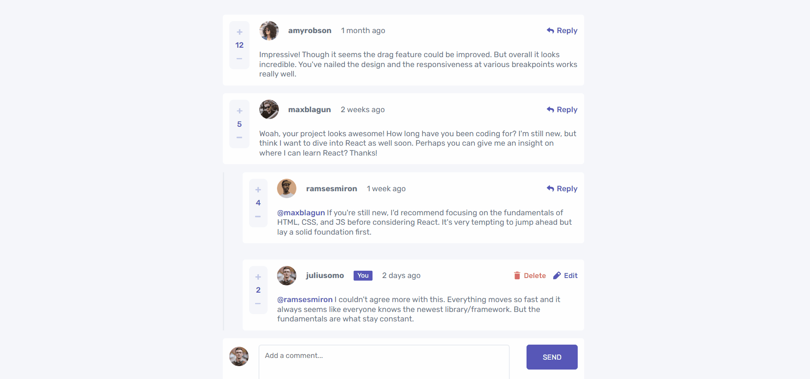

# Frontend Mentor - Interactive comments section solution

This is a solution to the [Interactive comments section challenge on Frontend Mentor](https://www.frontendmentor.io/challenges/interactive-comments-section-iG1RugEG9). Frontend Mentor challenges help you improve your coding skills by building realistic projects.

## Table of contents

- [Overview](#overview)
  - [The challenge](#the-challenge)
  - [Screenshot](#screenshot)
  - [Links](#links)
- [My process](#my-process)
  - [Built with](#built-with)
  - [What I learned](#what-i-learned)
  - [Continued development](#continued-development)
  - [Useful resources](#useful-resources)
- [Author](#author)


## Overview

### The challenge

Users should be able to:

- View the optimal layout for the app depending on their device's screen size
- See hover states for all interactive elements on the page
- Create, Read, Update, and Delete comments and replies
- Upvote and downvote comments
- **Bonus**: If you're building a purely front-end project, use `localStorage` to save the current state in the browser that persists when the browser is refreshed.
- **Bonus**: Instead of using the `createdAt` strings from the `data.json` file, try using timestamps and dynamically track the time since the comment or reply was posted.

### Screenshot



### Links

(Solution to be Added)

- Solution URL: [Frontend-Mentor-Solution](https://www.frontendmentor.io/solutions/interactivecommentsreact-scss-reduxtoolkit-reduxpersist-grid-WoTN9q2Kay)
- Live Site URL: [Comments-Interactive-Section](https://comments-interactive-section.netlify.app/)

## My process

### Built with

- Semantic HTML5 markup
- CSS/SASS (Variables & Mixins)
- Flexbox
- CSS Grid
- Mobile-first workflow
- [React](https://reactjs.org/) - JS library
- [React-Redux-Toolkit](https://nextjs.org/) - State Management Library
- [Redux-Persist](https://styled-components.com/) - State Persist in storage.
- [React-Toastify]() - UI Notification library

### What I learned

One of the main things I learn't from this project was how to use reusable components in react and how they work. I had used them in projects before but in this project I challenged myself to only use two main components for the project. One for the comments, then reused for displaying the replies. Another for the Comment Input, which was also used for the reply input. After playing around with these for a while, It finally clicked for me when I used the "CommentBox" component inside itself to display the replies, this led me to getting out of the mind set of treating the same component as the one component but completly seperate individual compenents which can be changed on there own, even though they are the same.

This then led me to learn that to create truly reusable components that props are the key. Using props allowed me to create different layouts and functionality within those components based on the props. I would insert and use different props into the components at different places thoughout the code, in order to change the compentent under a specific condition when needed. For Instance when I used the "CommentBox" Component for a reply, instead of a main comment, I would insert a prop "isReply" which was set to true and based on this I was able to manipulate the styles and functionality in order to match what I needed the component to do for the reply.

This kind of led to a type of loop, in this case, because I had a "commentBox" inside the main "commentBox" component and when I inserted the prop into the child component I then had to handle the prop though the parameters in the parent component. It can be confusing to follow the flow when used like this, but this has led me to having a much better understanding of reusable components and how powerfull then can be, and I feel I'm only scratching the surface of what reusable components can really do.

Heres a basic example of using props to change components, here Im using the same button component but changing the text when needed:

```js
<InputBox {...currentUser} name={"SEND"}/>

<InputBox {...currentUser} name={"REPLY"} id={id} parentUser={parentUser} replyingTo={user.username}/>
//
const InputBox = ({
  name,
  parentUser,
}) => {
  return (
    <section className={parentUser ? "input-box reply" : "input-box"}>
      <button
        form="comment"
        className="input-box__btn">
        {name}
      </button>
    </section>
  );
}
```

I also used "Redux-Persist" for the first time, this allowed me to store the state data, from the redux-toolkit state, to the local storage in a simple way. The main use of this is so the state data from the redux-toolkit can persist thoughout multiple refreshes.
If you want to know more, you can check out the docs here: [Redux-Persist](https://github.com/rt2zz/redux-persist)

Heres a quick example, we first set up the redux-persist in the store.

```js
import { configureStore } from "@reduxjs/toolkit";
import { persistStore, persistReducer } from "redux-persist";
import storage from "redux-persist/lib/storage"; // LocalStorage
import thunk from "redux-thunk";
import generalReducer from "./features/general/generalSlice";

const persistConfig = {
  key: "root",
  storage,
};

const persistedReducer = persistReducer(persistConfig, generalReducer);

let store = configureStore({
  reducer: {
    general: persistedReducer,
  },
  middleware: [thunk], // needed for non-serialized values.
});

let persistor = persistStore(store);
export { store, persistor };
```


We import the store & persistor, then wrap our application in the PersistGate and pass in the store data.
```js
import { store, persistor } from "./store";
import { Provider } from "react-redux";
import { PersistGate } from "redux-persist/integration/react";
//
const root = ReactDOM.createRoot(document.getElementById("root"));
root.render(
  <React.StrictMode>
    <Provider store={store}>
      <PersistGate loading={null} persistor={persistor}>
        <App />
      </PersistGate>
    </Provider>
  </React.StrictMode>
);
```

### Continued development

I will definitly be using Redux-Persist on small projects in the future, where I'm using redux-toolkit and localStorage because it makes it alot easier to persist the data of refeshed.

Also in future projects I will be taking what I learned about reusable components and apply them to future projects, because I feel they can be a very powerfull tool when it comes to building different segments of UI.

### Useful resources

- [Redux-Persist Docs](https://github.com/rt2zz/redux-persist) - If you want to check out more on this, check out there documentation.
- [Bobby-Hadz-Blog](https://bobbyhadz.com/blog/javascript-get-number-of-months-between-two-dates) - When creating the formula for the post times for the comments, I had to research how to get the amount of months between dates, which lead me to this blog posting by Bobby Hadz for reference, which was a great help for me. 

## Author

- Website - [David Henery](https://www.djhwebdevelopment.com)
- Frontend Mentor - [@David-Henery4](https://www.frontendmentor.io/profile/David-Henery4)
- LinkedIn - [David Henery](https://www.linkedin.com/in/david-henery-725458241)

